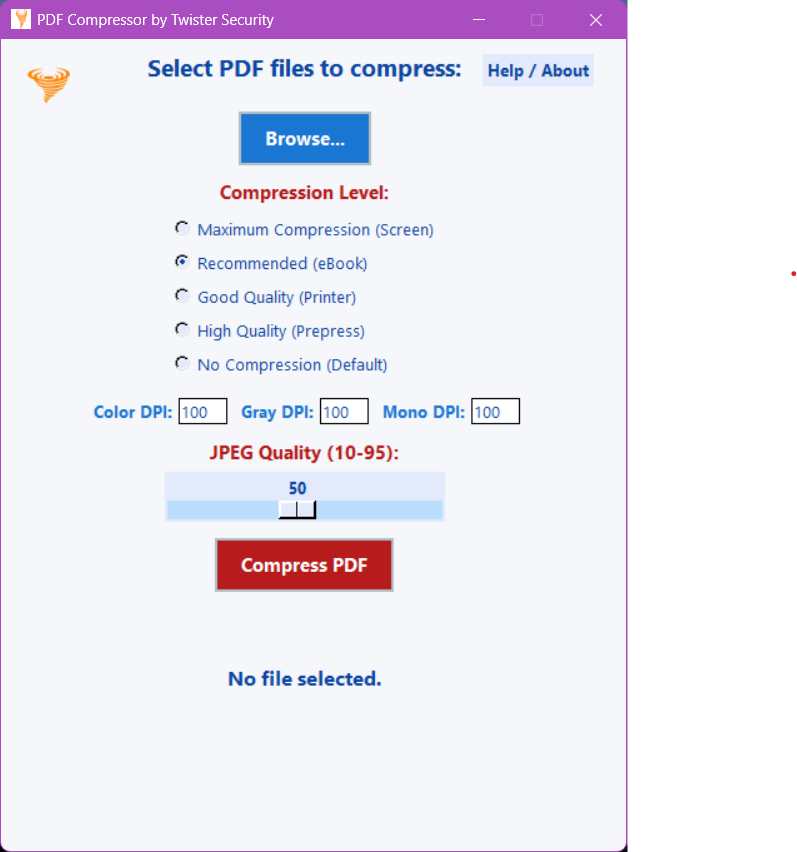
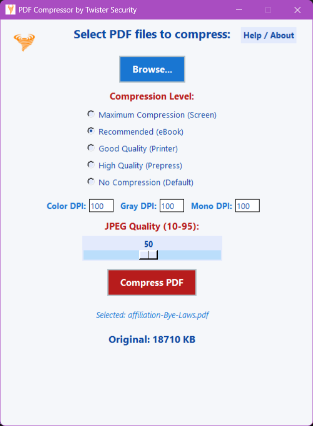
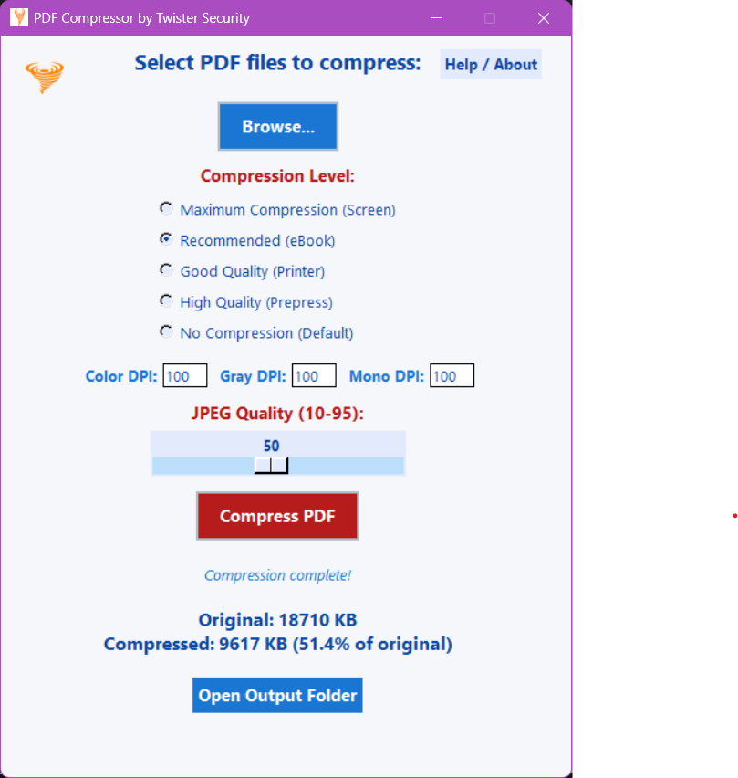

# LaghuPdf by Twister Security

## Overview
LaghuPdf is a modern, user-friendly Windows application for compressing PDF files using Ghostscript. It features a visually appealing GUI, supports batch processing, and provides clear feedback and help for users. The app is designed for both beginners and advanced users who want to reduce PDF file sizes efficiently.

---

## Features
- **Batch PDF Compression:** Select one or more PDF files for compression.
- **Compression Levels:** Choose from multiple quality presets (Screen, eBook, Printer, Prepress, Default).
- **Custom DPI & JPEG Quality:** Fine-tune color, gray, and mono DPI, and JPEG quality for best results.
- **Drag-and-Drop:** Easily drag PDF files onto the app window to select them.
- **Before/After Size Display:** See original and compressed file sizes, with percentage reduction.
- **Output Folder Selection:** Choose where compressed files are saved.
- **Open Output Folder:** Quickly open the folder containing your compressed PDFs.
- **Help/About Dialog:** Built-in instructions, compression level explanations, and contact info.
- **Ghostscript Integration:** Uses Ghostscript for robust, reliable PDF compression.
- **Custom Branding:** Uses a custom window icon.

---

## System Requirements
- Windows 10/11 (64-bit recommended)
- Python 3.8+ (for development; not needed for .exe)
- Ghostscript (must be installed and in your system PATH)
- No command prompt window (runs as a GUI app)

---

## Installation & Setup
1. **Download and Install Ghostscript:**
   - Visit: https://ghostscript.com/download/gsdnld.html
   - Download and install the latest version for Windows.
   - Add the Ghostscript `bin` folder (e.g., `C:/Program Files/gs/gs10.02.1/bin`) to your system PATH.

2. **Run the App:**
   - Double-click `LaghuPdf.exe` in the `dist` folder.
   - No installation is required for the .exe version.

---

## How to Use
1. **Select PDF Files:**
   - Click the **Browse...** button or drag-and-drop PDF files onto the app window.
   - You can select one or multiple files.

2. **Choose Compression Settings:**
   - Select a **Compression Level** (Screen, eBook, Printer, Prepress, Default).
   - Adjust **Color DPI**, **Gray DPI**, **Mono DPI**, and **JPEG Quality** as needed.
   - Hover over options for tooltips (if enabled).

3. **Compress PDFs:**
   - Click **Compress PDF**.
   - Choose an output folder for the compressed files.
   - The app will show progress and display before/after sizes.

4. **Open Output Folder:**
   - Click **Open Output Folder** to view your compressed PDFs.

5. **Help/About:**
   - Click **Help / About** (top right) for instructions, compression level details, and contact info.

---

## Compression Level & JPEG Quality Explained
### Compression Level
The **Compression Level** determines the balance between file size and quality. It sets Ghostscript's internal PDF settings:
- **Screen:** Maximum compression, lowest quality. Best for on-screen viewing and smallest file size.
- **eBook:** Recommended for most PDFs. Good balance of size and quality for general use.
- **Printer:** Good quality for printing, larger file size.
- **Prepress:** High quality for professional printing, largest file size.
- **Default:** Minimal compression, only minor optimizations. Use if you want to keep the original quality as much as possible.

**Tip:** If you want the smallest file, choose Screen. For best quality, choose Prepress or Default.

### JPEG Quality
**JPEG Quality** controls the compression of images inside your PDF. Lower values (10-50) mean higher compression and smaller files, but lower image quality. Higher values (70-95) keep images sharper but result in larger files.
- **Recommended:** 40-60 for most documents.
- **For photos:** Use 70+ if you want to preserve image detail.
- **For scanned docs:** 30-50 is usually enough.

**Tip:** If your PDF has lots of images, lowering JPEG Quality will greatly reduce file size, but may make images look blurry.

---

## Troubleshooting
- **Ghostscript Not Found:**
  - If you see a warning, ensure Ghostscript is installed and its `bin` folder is in your system PATH.
  - Restart the app after installing Ghostscript.
- **Compression Fails:**
  - Check that the PDF is not open in another program.
  - Ensure you have write permissions to the output folder.
- **Drag-and-Drop Not Working:**
  - Make sure `tkinterdnd2` is installed (for Python version).
  - The .exe version includes drag-and-drop if built with the correct dependencies.

---

## Screenshots
Below are some example screenshots of the app in use:

### Main Window

### Compression Settings

### After Compression

*(Replace the above image paths with your actual screenshot files in a `dist/Screenshots/` folder.)*

---

## Contact & Support
- **Developer:** Devesh Agarwal
- **Email:** devesh@twistersecurity.com
- **Website:** https://twistersecurity.com

For bug reports, feature requests, or support, please contact the developer.

---

## License
This software is provided as-is for personal and business use. For redistribution or commercial licensing, contact the developer.

---

## Credits
- Built with Python, Tkinter, Pillow, tkinterdnd2, and Ghostscript.
- UI design and code by Twister Security.

---

## Changelog
- v1.0: Initial release with all major features and UI polish.

---

Thank you for using LaghuPdf by Twister Security!
